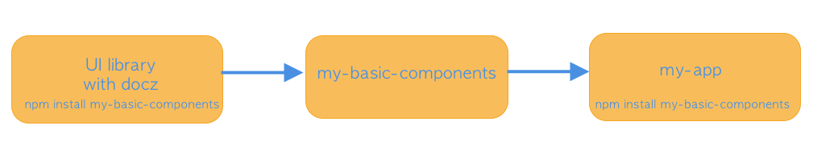

# itr-components-lib

UI Library to document the design standards, Html and React components.

This repo is just the UI design library. 

The components will be implemented in a separate repo and package in order to be able to use that  <a href="https://www.npmjs.com/package/@itreverie/itr-components-basics" target="_blank">itr-components-package</a> into the web application 
just install it with:

``npm i @itreverie/itr-components-basics``

This is the genral idea of the whole architecture. Remember this repos is just the UI Library.

